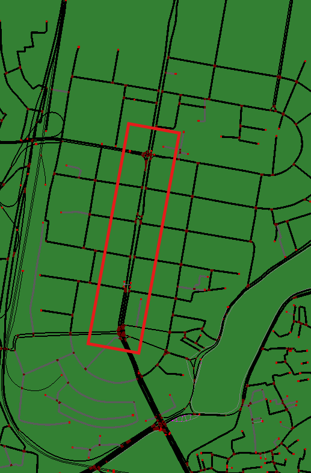
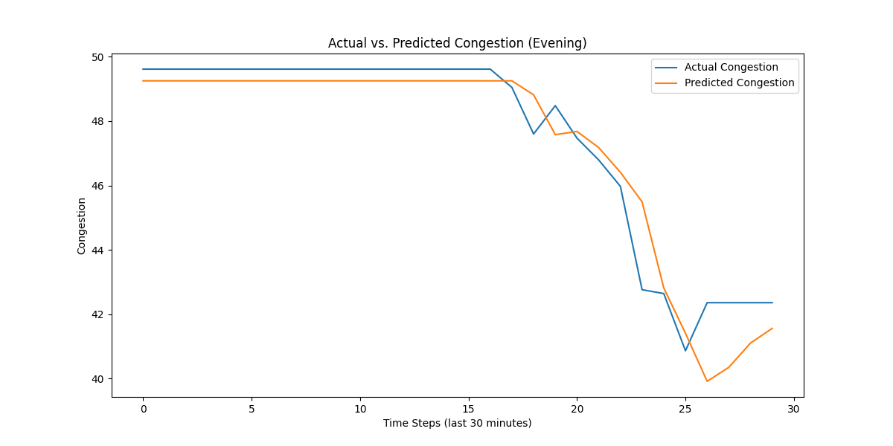
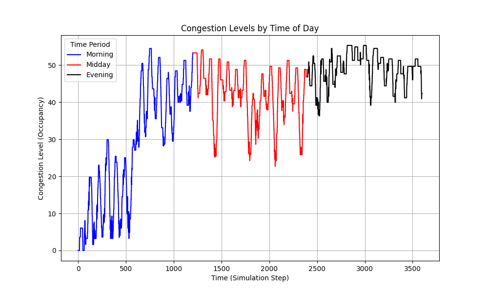

# Traffic Simulation and Congestion Analysis

This project simulates traffic flow and congestion levels using **SUMO** (Simulation of Urban Mobility) and **Python**. It focuses on generating dynamic traffic flows and analyzing congestion patterns during different times of the day. The project also includes data collection and classification of congestion levels, as well as prediction and visualization of peak congestion periods.

## Table of Contents
- [Overview](#overview)
- [Setup Instructions](#setup-instructions)
- [Usage](#usage)
- [Data Analysis](#data-analysis)
  - [Classifying Congestion Levels](#classifying-congestion-levels)
  - [Congestion Over Time prediction with LSTM](#Congestion-Over-Time-prediction-with-LSTM)
  - [Congestion by Time of Day](#congestion-by-time-of-day)
- [Dependencies](#dependencies)

## Overview
The simulation generates dynamic traffic flow and congestion data based on the real-time traffic simulation conditions. The analysis focuses on identifying peak congestion periods by classifying congestion levels (Low, Moderate, High) based on lane occupancy. The project also uses this data to predict high congestion periods, allowing for improved traffic management strategies.

### Key Features:
- Simulation of traffic flow and congestion using SUMO.
- Classification of congestion levels (Low, Moderate, High).
- Analysis of congestion patterns during morning, midday, and evening periods.
- Visualization of congestion data and flow trends.
- Export of traffic flow and congestion data to CSV files for further analysis.

## Setup Instructions

### Prerequisites:
1. **SUMO**: Make sure SUMO (Simulation of Urban MObility) is installed. Follow the instructions on [SUMO's official website](https://www.eclipse.org/sumo/) to install SUMO.
2. **Python**: Python should be installed.
3. **Required Python Libraries**:
   - `traci`: Interface for Python to control the SUMO simulation.
   - `matplotlib`: For data visualization.
   - `pandas`: For data manipulation and analysis.
   - `Tensorflow`: For importing LSTM
### Files:
- [mogbazar.net.xml](mogbazar.net.xml) : Main net.xml file with the road network which was previously downloaded as map.osm from [Open Street Map](https://www.openstreetmap.org/search?query=dhaka%20satrasta#map=17/23.759645/90.401087) to get a real road condition in Dhaka city.
-  
- [simulate_traffic.py](simulate_traffic.py): Main Python script to run the simulation and collect traffic data.
- [mogbazar.sumocfg](mogbazar.sumocfg): The SUMO configuration file for the traffic simulation (included in the project).
- [flow_data.csv](flow_data.csv): Output File containing traffic flow data over time (vehicles per step).
- [congestion_data.csv](congestion_data.csv): Output File containing congestion (occupancy) data over time.

## Usage
- **Start the Traffic Simulation**: Run the simulate_traffic.py script to start the traffic simulation. The simulation will generate traffic flow and congestion data and store it in flow_data.csv and congestion_data.csv
- **Data Files**: The traffic simulation generates two CSV files: flow_data.csv: Contains traffic flow data (vehicles per step) and congestion_data.csv: Contains lane congestion data (occupancy).
- **Visualization**: After running the simulation and generating the CSV files, you can visualize the congestion levels by plotting the data using the script in the provided [notebook](from_SUMO.ipynb)

## Data Analysis
- Simulation: 
- classifying Congestion Levels: Congestion levels are classified into three categories:
                                                                 - Low: Occupancy below 30%.
                                                                 - Moderate: Occupancy between 30% and 70%.
                                                                 - High: Occupancy above 70%.
- This classification helps in understanding the traffic flow and congestion during different periods of the day.
- Congestion Over Time prediction with LSTM: 
- Congestion by Time of Day: 

## Dependencies
- SUMO (Simulation of Urban MObility): Used for traffic simulation.
- traci: Python interface to control the SUMO simulation.
- matplotlib: For visualizing data (plots).
- pandas: For data manipulation and analysis
- Tensorflow: For importing LSTM
 
